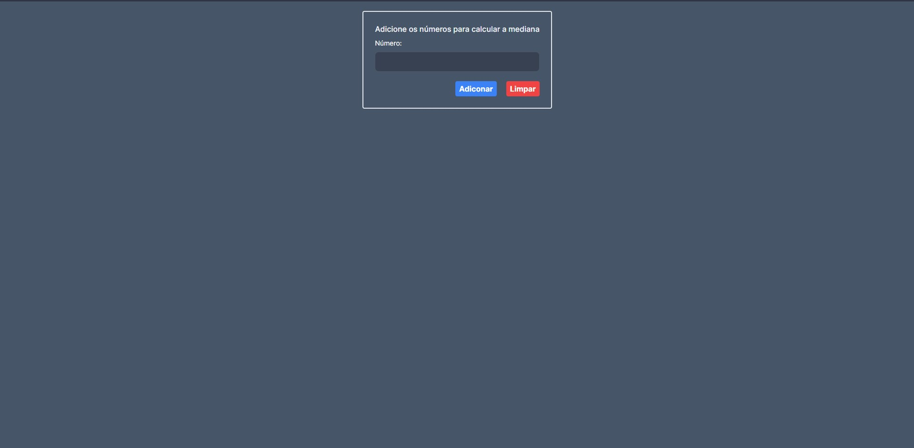
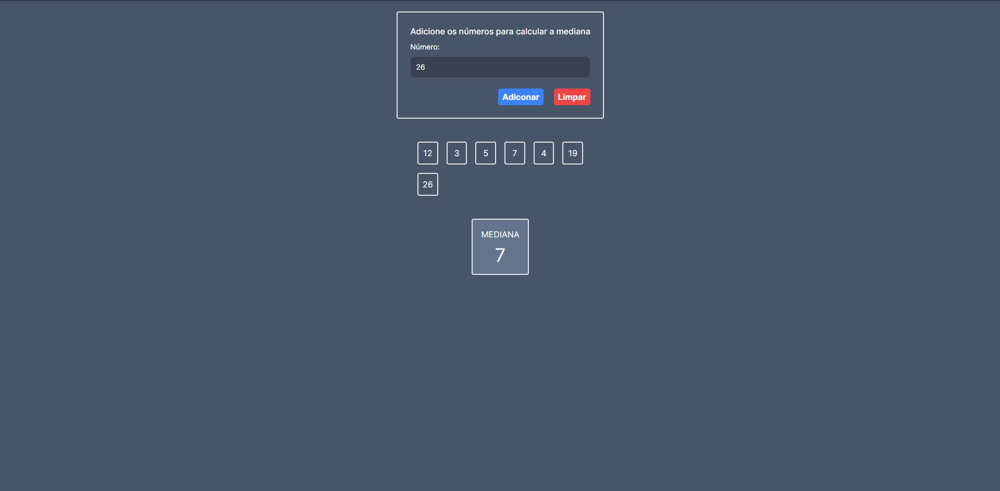
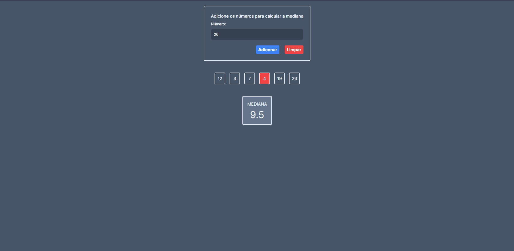

# Mediana

**Número da Lista**: 48<br>
**Conteúdo da Disciplina**: D&C<br>

## Alunos

| Matrícula  | Aluno                      |
| ---------- | -------------------------- |
| 19/0015721 | Júlio César Martins França |

## Sobre

O objetivo do projeto é calcular a mediana de um conjunto de números utilizando o algoritmo Mediana das Medianas.

## Screenshots





## Instalação

**Linguagem**: JavaScript<br>
**Framework**: Next.js<br>

### Pré-requisitos

- Ter o [Node.js](https://nodejs.org/en) instalado
- Foi utilizada a v18.16.0 nesse projeto

### Como rodar o projeto

Depois de clonar o repositório:

- Entrar no diretório "mediana"

```
cd mediana/
```

- Instalar as dependências

```
npm install
```

- Rodar o projeto

```
npm run dev
```

O projeto será aberto no link http://localhost:3000/

## Uso

- A medida que os numeros vão sendo adicionados, a mediana será calculada e aparecerá na tela.
- Para exclui apenasa um número da lista de números, clique em cima do mesmo.
